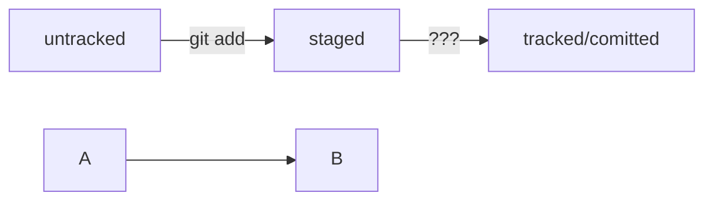

# Шпоргалка по Git'у

## Собраны основные действия с обучающего курса яндекс практикума

1. *переход в домашнюю директорию*

```
$ cd ~/dev/first-project # перешли в нужную папку
```

2. *создание репозитория*

```
$ git init # создали репозиторий
```

3. *«Разгитить» папку, если что-то пошло не так*

```
$ cd <папка с репозиторием> # перешли в папку

$ rm -rf .git # удалили подпапку .git
```

4. *Проверить состояние репозитория*

```
git status
```

5. *Создание файлов*

```
$ touch todo.txt
$ touch readme.txt
# создали файлы todo.txt и readme.txt
```

6. *Подготовка к сохранению*

```
$ git add --all # подготовили к сохранению все файлы в репозитории
```

```
$ git add todo.txt # подготовили один файл - todo.txt в репозитории
```

```
$ git add . # добавить всю текущую папку
```

7. *Выполнить коммит*

```
$ git commit -m 'Мой первый коммит!'
```

Conventional Commits — это способ оформления сообщений к коммитам
* feat (от английского feature) — означает добавление новой функциональности;
* fix (от английского fix — исправить) — означает исправление ошибок.

8. *Просмотреть историю коммитов*

```
git log
```

9. *Проверка наличия SSH-ключа*

```
$ cd ~ # перешли в домашнюю директорию

$ ls -la .ssh/ # вывели список созданных ключей
```

10. *Для генерации SSH-пары*

```
$ ssh-keygen -t ed25519 -C "электронная почта, к которой привязан ваш аккаунт на GitHub"
```

Если вы видите сообщение об ошибке, то, скорее всего, ваша система не поддерживает алгоритм шифрования ed25519. Ничего страшного: используйте другой алгоритм.

```
$ ssh-keygen -t rsa -b 4096 -C "электронная почта, к которой привязан ваш аккаунт на GitHub"
```

Укажите место хранения ключей

```
> Enter a file in which to save the key (C:\Users\<имя_пользователя>\.ssh\):[Press enter]
```

11. *проверить наличие созданных SSH-ключей*

```
ls -a ~/.ssh
```

12. *Проверьте правильность ключа*

```
$ ssh -T git@github.com
```

13. *Привязать удалённый репозиторий к локальному*
------------------
В качестве имени используйте слово origin. А URL вы скопировали со страницы удалённого репозитория.

```
$ cd ~/dev/first-project
$ git remote add origin git@github.com:%ИМЯ_АККАУНТА%/first-project.git
```

14. *Убедиться, что репозитории связаны*

```
$ git remote -v
```

15. *Отправить изменения на удалённый репозиторий*

```
$ git push -u origin main # Если команда приведёт к ошибке, попробуйте заменить main на master.
```

16. *Получить сокращённый лог*

```
git log --oneline
```

17. *Графы*



17. *Как исправить коммит*


```
git commit --amend --no-edit #Дополнить коммит новыми файлами
```
---------------
```
git commit --amend -m "Добавить главную страницу и стили" #Изменить сообщение коммита
```

18. *Выполнить unstage изменений*

```
git restore --staged <file> #отмена добавления в коммит (обратно в untracked)
```
------------------
```
git restore --staged .   #Для сброса всей текущейю папки (.)
```

19. *«Откатить» коммит*

```
git reset --hard <commit hash>    #«откатить» то, что уже было закоммичено, то есть вернуть состояние репозитория к более раннему
```

20. *«Откатить» изменения, которые не попали ни в staging, ни в коммит*

```
git restore <file>    #Изменения в файле «откатятся» до последней версии, которая была сохранена через git commit или git add
```

21. *Просмотр и сопоставление коммитов*

Эта команда поможет узнать, какие строки и в каких файлах изменились

```
git diff   #Эта команда сравнит последнюю закоммиченную версию файла с текущей (изменённой) версией (modified)
```
---------------

```
git diff --staged     #Чтобы просмотреть изменения в staged, нужно использовать флаг --staged
```

```
git diff <коммит1> <коммит2>    #позволит понять, что изменилось в одном коммите по сравнению с другим
```

22. *Игнорирование файлов в Git (.gitignore)*

Правила из .gitignore применяются только к новым (untracked) файлам.
Если файл уже попал в staging area или в коммит, то правила на него не распространяются.

```
# для macOS
.DS_Store
# игнорировать все файлы, которые заканчиваются на .jpeg
*.jpeg
# игнорировать все файлы "tmp" во всех подпапках папки docs
docs/*/tmp
# странное, но возможное правило
# "игнорировать все файлы"
*
```
-------------
Вопросительный знак ? соответствует одному любому символу. 
Квадратные скобки, как и вопросительный знак, соответствуют одному символу.
При этом символ не любой, а только из списка, который указан в скобках.

```
file?.txt   #будут проигнорированы файлы fileA.txt и file1.txt, файл file12.txt не будет проигнорирован
# игнорировать файлы file0.txt, file1.txt и file2.txt
# при этом не игнорировать file3.txt, file4.txt, ...
file[0-2].txt    #В скобках можно либо перечислить символы ([abc]), либо задать диапазон ([a-z])
```
-------------
Косая черта, или слеш (/), указывает на каталоги

```
# игнорировать todo.txt в корне репозитория
/todo.txt
# для сравнения: spam.txt будет игнорироваться во всех папках
spam.txt 
# игнорировать папку build
build/
```

------------
Парные звёздочки (**) - работают с вложенными папками.

```
# игнорировать файлы "docs/current/tmp", "docs/old/tmp",
# а также "docs/old/saved/a/b/c/d/tmp"
# и даже "docs/tmp", потому что ноль вложенных папок тоже подходит
docs/**/tmp

# игнорировать только "docs/current/tmp" и "docs/old/tmp"
# файл "docs/old/saved/a/b/c/d/tmp" не попадает в правило
docs/*/tmp
```

---------------
Восклицательный знак (!) - для инвертирования правил игнорирования

```
# игнорировать все JPEG-файлы
*.jpeg

# но только не мем с Doge
!doge.jpeg
```

-------------
Если всё же нужно отобразить все игнорируемые файлы,
то это можно сделать с помощью ключа --ignored

Пример .gitignore

```
# игнорировать все файлы
**

# кроме .tex и .pdf
!**.tex
!**.pdf 
```
