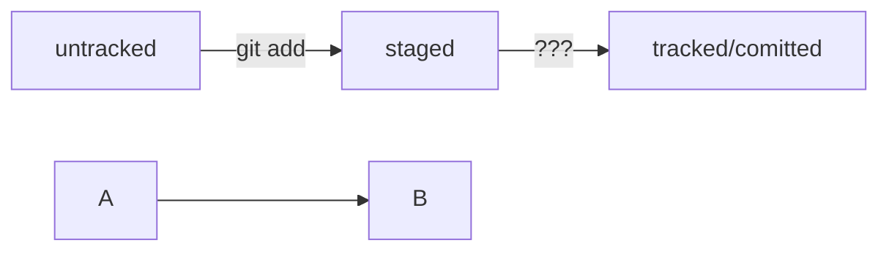

# Шпоргалка по Git'у

## Собраны основные действия с обучающего курса яндекс практикума

1. *переход в домашнюю директорию*

```
$ cd ~/dev/first-project # перешли в нужную папку
```

2. *создание репозитория*

```
$ git init # создали репозиторий
```

3. *«Разгитить» папку, если что-то пошло не так*

```
$ cd <папка с репозиторием> # перешли в папку

$ rm -rf .git # удалили подпапку .git
```

4. *Проверить состояние репозитория*

```
git status
```

5. *Создание файлов*

```
$ touch todo.txt
$ touch readme.txt
# создали файлы todo.txt и readme.txt
```

6. *Подготовка к сохранению*

```
$ git add --all # подготовили к сохранению все файлы в репозитории
```

```
$ git add todo.txt # подготовили один файл - todo.txt в репозитории
```

```
$ git add . # добавить всю текущую папку
```

7. *Выполнить коммит*

```
$ git commit -m 'Мой первый коммит!'
```

Conventional Commits — это способ оформления сообщений к коммитам
* feat (от английского feature) — означает добавление новой функциональности;
* fix (от английского fix — исправить) — означает исправление ошибок.

8. *Просмотреть историю коммитов*

```
git log
```

9. *Проверка наличия SSH-ключа*

```
$ cd ~ # перешли в домашнюю директорию

$ ls -la .ssh/ # вывели список созданных ключей
```

10. *Для генерации SSH-пары*

```
$ ssh-keygen -t ed25519 -C "электронная почта, к которой привязан ваш аккаунт на GitHub"
```

Если вы видите сообщение об ошибке, то, скорее всего, ваша система не поддерживает алгоритм шифрования ed25519. Ничего страшного: используйте другой алгоритм.

```
$ ssh-keygen -t rsa -b 4096 -C "электронная почта, к которой привязан ваш аккаунт на GitHub"
```

Укажите место хранения ключей

```
> Enter a file in which to save the key (C:\Users\<имя_пользователя>\.ssh\):[Press enter]
```

11. *проверить наличие созданных SSH-ключей*

```
ls -a ~/.ssh
```

12. *Проверьте правильность ключа*

```
$ ssh -T git@github.com
```

13. *Привязать удалённый репозиторий к локальному*
------------------
В качестве имени используйте слово origin. А URL вы скопировали со страницы удалённого репозитория.

```
$ cd ~/dev/first-project
$ git remote add origin git@github.com:%ИМЯ_АККАУНТА%/first-project.git
```

14. *Убедиться, что репозитории связаны*

```
$ git remote -v
```

15. *Отправить изменения на удалённый репозиторий*

```
$ git push -u origin main # Если команда приведёт к ошибке, попробуйте заменить main на master.
```

16. *Получить сокращённый лог*

```
git log --oneline
```

17. *Графы*


HEAD -- это голова.
Коммит -- это всему голова.
Статусы файлов:
<тут пустая строка!>

```mermaid
%% описание схемы
```
<и тут пустая строка!>

17. *Как исправить коммит*


```
git commit --amend --no-edit #Дополнить коммит новыми файлами
```

```
git commit --amend -m "Добавить главную страницу и стили" #Изменить сообщение коммита
```

18. *Выполнить unstage изменений*

```
git restore --staged <file> #отмена добавления в коммит (обратно в untracked)
```
------------------
```
git restore --staged .   #Для сброса всей текущейю папки (.)
```

19. *«Откатить» коммит*

```
git reset --hard <commit hash>    #«откатить» то, что уже было закоммичено, то есть вернуть состояние репозитория к более раннему
```
